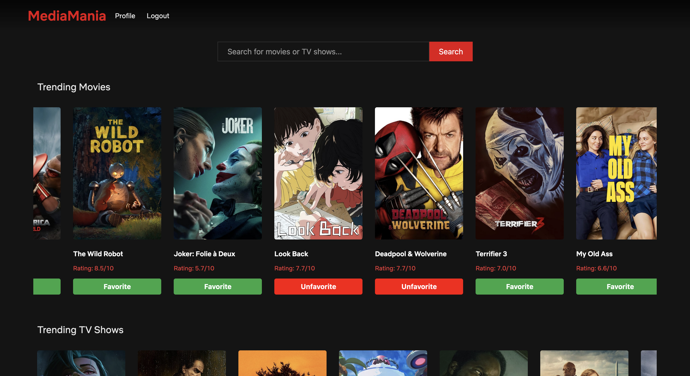
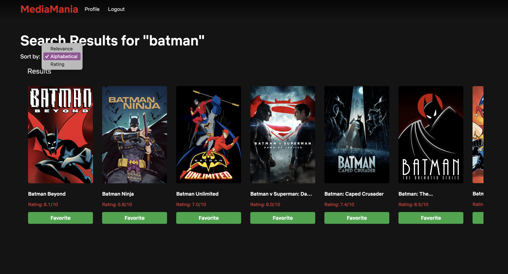
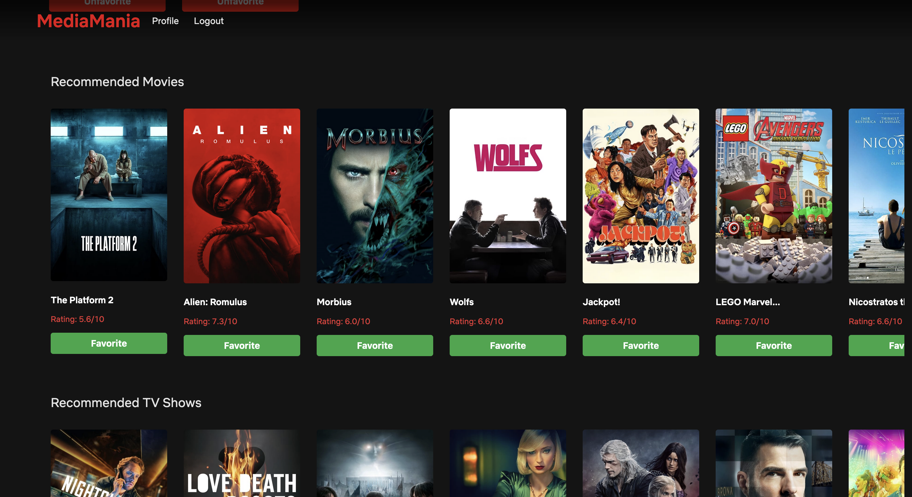

# MediaMania

MediaMania is a web application that enables users to explore trending movies and TV shows, search for specific media content, and maintain a profile with a personalized list of favorite shows and movies. Built with Flask and integrated with The Movie Database (TMDb) API, MediaMania also provides recommendations based on favorited media and includes an interactive UI for easy navigation.

## Table of Contents
    1. Features
    2. Screenshots
    3. Technologies Used
    4. Installation & Setup
    
## Screenshots

    
    
    

## Technologies Used
- Backend: Flask, Flask-SQLAlchemy, Flask-Login, Flask-WTF, Flask-Migrate
- Frontend: HTML, CSS, JavaScript (with jQuery)
- Database: SQLite
- API: The Movie Database (TMDb) API
## Installation & Setup

**Prerequisites:**
- Python 3.8+ is recommended for compatibility.
- A TMDb API key is required. Create an account on TMDb to get an API key.
- Open your terminal to run the commands below

Clone the Repository:

**git clone https://github.com/905j/MediaMania.git**

**cd MediaMania**

Create and Activate a Virtual Environment:

**python -m venv venv**

**source venv/bin/activate  # On Windows, use `venv\Scripts\activate`**

Install Requirements:
**pip install -r requirements.txt**

**Set Up Environment Variables**

Create a .env file in the project’s root directory and add your TMDb API key: TMDB_API_KEY=your_key

Run the following commands to set up the SQLite database and apply migrations:

**flask db init**

**flask db migrate -m "Initial migration."**

**flask db upgrade**

Start the Flask development server:

**flask run**

Access the Application:

**Open your web browser and go to http://127.0.0.1:5000 to view MediaMania.**
